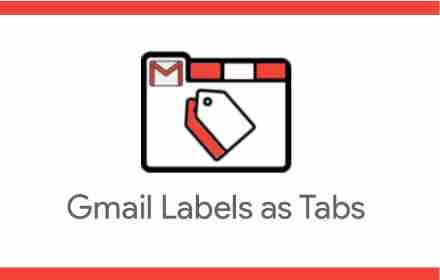
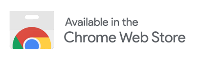
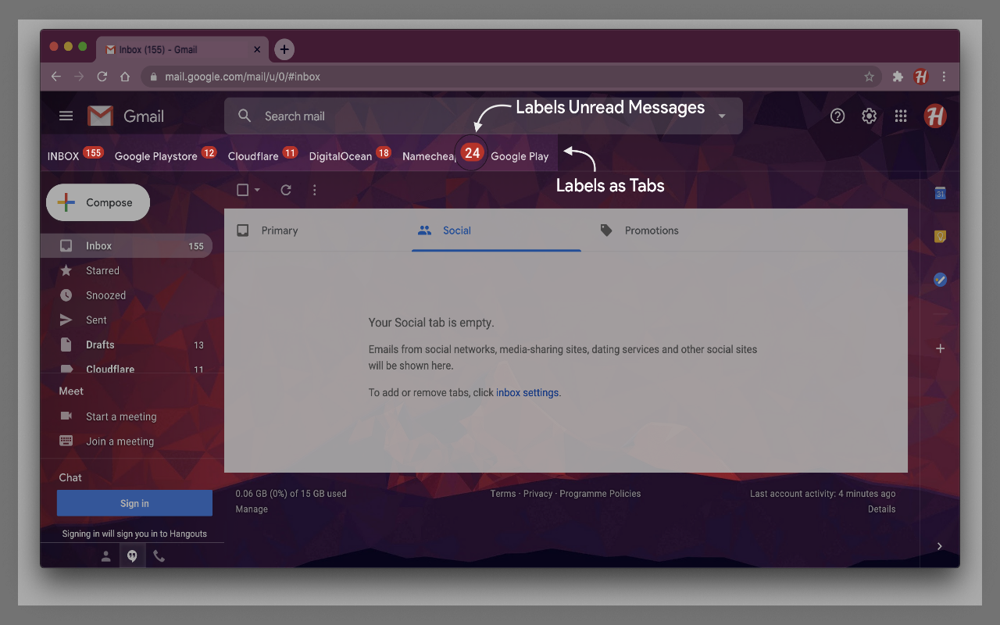

<link rel="shortcut icon" type="image/x-icon" href="gmail-labels-as-tabs/images/icons/16.png">
  

  

**Gmail Labels as Tabs** is an email productivity extension for Google Chrome that customizes your Gmail interface by adding Gmail labels as tabs.

★ Organize your labels as Gmail tabs

★ Drag and drop to re-arrange tabs

★ Shows unread messages badge

★ Supports dark mode theme

★ Synchronizes extension settings with your Gmail account

★ 100% open-source and ads-free - we don’t mine your data, we don’t sell your data

### Watch 20 seconds "How-to" video on Youtube

### Screenshots

## Developer
[Puru Tuladhar](https://tuladhar.github.io/about-me/)

## [:heart: Donation](https://tuladhar.github.io/gmail-labels-as-tabs/DONATION)
